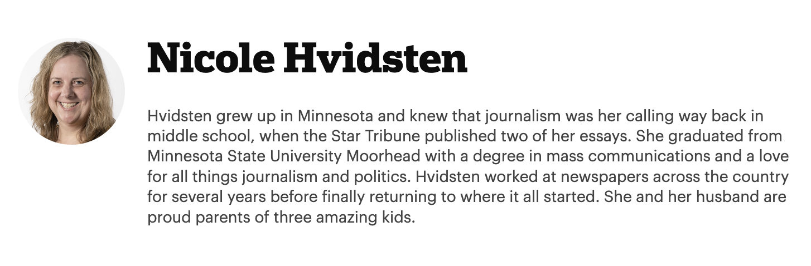

# Frontend Technical Assessment — Author Page & Linking

This is a frontend repository using:

- **Frontend**: [Next.js](https://nextjs.org/) + [Tailwind CSS](https://tailwindcss.com/) + TypeScript (App Router)

---

## 🛠 Getting Started

### 1. Fork & Clone

Click "Fork" on GitHub, then clone your copy:

```bash
git clone git@github.com:MinneapolisStarTribune/technical-interview-repo.git
cd technical-interview-repo
```

### Install Dependencies
```bash
yarn install
````

## Controls
### Start the Frontend (Next.js)
```bash
yarn dev:web
```
Runs the Next.js app in development mode

Available at http://localhost:3000

### Run Tests
```bash
yarn test
```
You can also run tests in individual apps by running `yarn workspace web test` or `yarn workspace api test`

---

## Instructions
Below is a sample ticket you might receive at the Minnesota Star Tribune, written by a product manager or scrum master.

Your task is to read through it, understand the intent, and implement a solution. This is your opportunity to show us how you approach a problem, organize your code, and communicate trade-offs or ideas. If you see opportunities to improve the existing code, feel free to go for it — or leave a comment noting what you'd change and why.

⏱️ **Time Expectations**  
Please aim to spend around **1 hour** on this. No more than **2 hours max** — we want to respect your time.

💬 **Stuck or Blocked?**  
It happens!

If you run into any snags — whether it’s the repo not setting up, you’re confused about the project structure, or something just isn’t clicking — please reach out to the hiring manager. Asking for help is a skill we value deeply here, and we see debugging and pair-programming as collaborative, not corrective.

If you need a hand, we’ll hop on a quick call and work through it together. This isn’t a test of perfection — it’s a chance to get a feel for how we solve problems together.

📦 **Submitting Your Work**  
When you’re done, push your changes to GitHub and create a draft Pull Request. During the technical portion of your final interview, you’ll sit down with a team member to walk through your solution and discuss your approach, trade-offs, and ideas.

---

### ✨ Feature: Author Profile Pages

**Problem Statement**
Right now, our app shows a list of articles, but there's no way to explore more about the authors behind the work. Readers can see a byline, but they can’t learn who the author is or what else they’ve written.

**Proposed Solution**
We recently introduced a dedicated dataset of authors (`apps/web/src/hardcoded-data/authors.tsx`). Let’s use this to power a brand new author profile page. Clicking an author’s name will take the user to `/author/author-name`, where they can learn more about that journalist.

**Business Value**
Author pages help personalize the reading experience and strengthen trust. They create a clearer sense of voice and expertise while also encouraging deeper engagement with related content. This improves reader retention and lays the groundwork for future features like "follow this author" or "trending journalists."

**Business Requirements**
 - All author names should be clickable.
 - Clicking on a name should navigate to `/author/author-name`.
    - The author page must include:
        - Author’s full name
        - Their bio
        - A headshot image

**Design Comps**


It’s expected that your implementation will not match the design exactly.

### ❓ Open Question
We’d **LOVE** to include previews of that author’s articles on their profile page. Is that something you think is feasible given how the data is currently set up?
It's alright if it’s out of scope — but if it’s a relatively straightforward addition, we’d love to see it explored!